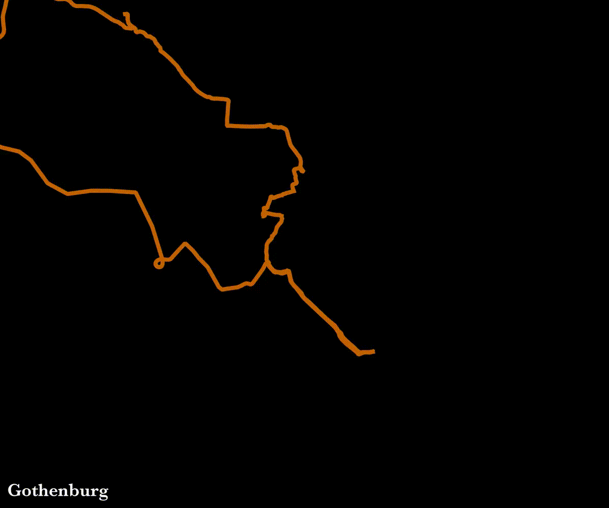

# bike-exploration

Animations of bike exploration in various cities

- Inspired by this [this post](https://www.reddit.com/r/dataisbeautiful/comments/f8nu0c/oc_this_is_how_londons_street_grid_reveals_using/) and [this tutorial](https://medium.com/@tjukanov/animated-routes-with-qgis-9377c1f16021)

## Results

### Gothenburg



- Time range: 2020-04-05 to 2021-04-23 (383 days)
- Num routes: 223
- Total distance: 3,757 miles

### Denver


- Time range: 2021-08-06 to 2022-11-14 (465 days)
- Num routes: 179
- Total distance: 2,605 miles

### Boston


- Time range: 2023-03-06 to 2024-11-15 (619 days)
- Num routes: 300
- Total distance: 5,643 miles

## Setup

```bash
conda create -c conda-forge -n strava python=3.12 pandas jupyterlab geopandas
pip install gpxpy fitparse tqdm
pip install "rich[jupyter]"
```

## Usage

Bulk download all the strava data and put it somewhere, like `data/strava`.

Run `main.py`

## Setup note - jupyter notebook

So that only the code is saved in the notebook, and not the output,

I added to .git/config:

```ini
[filter "strip-notebook-output"]
    clean = "jupyter nbconvert --ClearOutputPreprocessor.enabled=True --to=notebook --stdin --stdout --log-level=ERROR"
```

And created .gitattributes:

```txt
*.ipynb filter=strip-notebook-output
```
